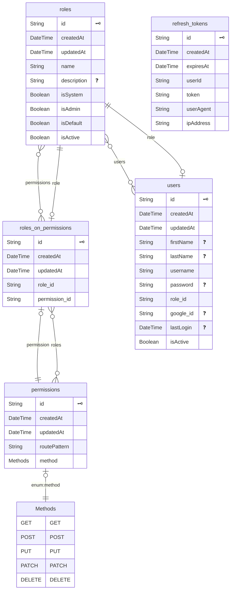

```mermaid
erDiagram

        Methods {
            GET GET
POST POST
PUT PUT
PATCH PATCH
DELETE DELETE
        }
    
  "roles" {
    String id "🗝️"
    DateTime createdAt 
    DateTime updatedAt 
    String name 
    String description "❓"
    Boolean isSystem 
    Boolean isAdmin 
    Boolean isDefault 
    Boolean isActive 
    }
  

  "permissions" {
    String id "🗝️"
    DateTime createdAt 
    DateTime updatedAt 
    String routePattern 
    Methods method 
    }
  

  "roles_on_permissions" {
    String id "🗝️"
    DateTime createdAt 
    DateTime updatedAt 
    String role_id 
    String permission_id 
    }
  

  "users" {
    String id "🗝️"
    DateTime createdAt 
    DateTime updatedAt 
    String firstName "❓"
    String lastName "❓"
    String username 
    String password "❓"
    String role_id 
    String google_id "❓"
    DateTime lastLogin "❓"
    Boolean isActive 
    }
  

  "refresh_tokens" {
    String id "🗝️"
    DateTime createdAt 
    DateTime expiresAt 
    String userId 
    String token 
    String userAgent 
    String ipAddress 
    }
  
    "roles" o{--}o "users" : "users"
    "roles" o{--}o "roles_on_permissions" : "permissions"
    "permissions" o|--|| "Methods" : "enum:method"
    "permissions" o{--}o "roles_on_permissions" : "roles"
    "roles_on_permissions" o|--|| "roles" : "role"
    "roles_on_permissions" o|--|| "permissions" : "permission"
    "users" o|--|| "roles" : "role"
```
